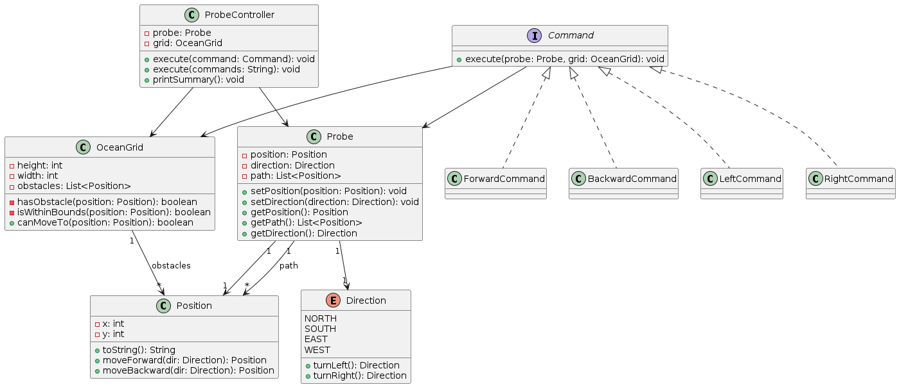

# Ocean Explorer - Probe Navigation System

## Overview
This project implements a probe navigation system on a 2D ocean grid. The probe can move forward, backward, and rotate left or right while avoiding obstacles and staying within grid boundaries.

The design focuses on clean separation of concerns and extensibility.

---

## Design Approach

The system is composed of the following components:

### OceanGrid
- Handles boundary validation
- Detects obstacles
- Decides whether movement is allowed

### Probe
- Maintains state:
  - Current position
  - Current direction
  - Traversed path

### Command Pattern
Encapsulates movement behavior:
- `F` → Forward
- `B` → Backward
- `L` → Turn Left
- `R` → Turn Right

### ProbeController
- Parses and executes commands
- Coordinates between Probe and OceanGrid
- Generates execution summary

---

## Key Design Decisions

### Command Pattern
Used to decouple behavior from domain objects.

**Advantages:**
- Extensible (add new commands without modifying existing code)
- Avoids large switch-case blocks
- Follows Open/Closed Principle

---

### Separation of Responsibilities

| Component       | Responsibility                     |
|----------------|----------------------------------|
| OceanGrid      | Validation (bounds + obstacles)  |
| Probe          | State management                 |
| Command        | Behavior encapsulation           |
| ProbeController| Execution orchestration          |

---

### Immutable Position
- Prevents unintended mutations
- Ensures correctness in movement and path tracking

---

### Extensibility
To add a new command:
1. Implement `Command`
2. Register it in `CommandFactory`

No changes required in existing logic.

---

## Execution Flow

1. Input command string (e.g., `FFRFFLBB`)
2. Convert into commands using factory
3. Execute sequentially
4. Each command:
   - Computes next position/direction
   - Validates via OceanGrid
   - Updates Probe state if valid

---

